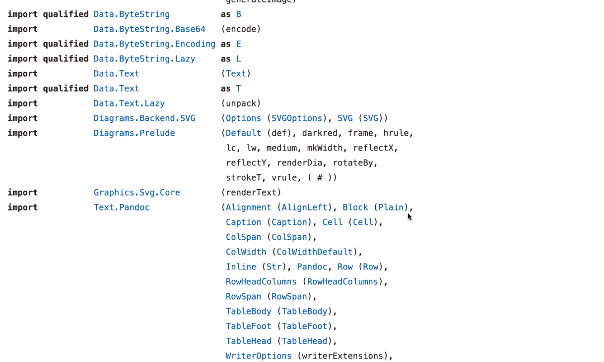

# Transform your old and tired Haskell source files into shining Notebooks

Have you ever suffered from Notebook envy?
    
Have you ever felt a pang of jealousy about Python programmers and their cool data science Jupyter notebooks?

The most complete antidote to this particular form of existential angst is installing Haskell's own [Jupyter backend](https://hackage.haskell.org/package/ihaskell).

But if, like many Haskell developers these days, you use the [Haskell Language Server](https://github.com/haskell/haskell-language-server) and [VS Code](https://code.visualstudio.com/), you can immediately transform any Haskell source file into a rough and ready notebook without any additional configuration and without the need to run another bulky server.

# Demo

Check out this [example](src/Notebook.hs) of generating and displaying:

* mathematical formulas

* images

* all kinds of charts and graphs

* [diagrams](https://hackage.haskell.org/package/diagrams)

* data tables


Demo video captured using [LICECap](https://www.cockos.com/licecap/).

# Now You Do It

* Install the VS Code extension [Markdown Everywhere](https://marketplace.visualstudio.com/items?itemName=zhaouv.vscode-markdown-everywhere). This will instruct VS Code to display Markdown/HTML code embedded in Haskell comments.

* Optional: Install a [Mermaid](https://mermaid-js.github.io/mermaid) VS Code extension like [Markdown Mermaid](https://marketplace.visualstudio.com/items?itemName=bierner.markdown-mermaid).

* Generate Markdown/HTML code in Haskell comments using HLS's built-in [eval plugin](https://github.com/haskell/haskell-language-server/blob/master/plugins/hls-eval-plugin/README.md). Check out [src/Notebook.hs](src/Notebook.hs) for examples and tips.

* **⌘K V** in the Haskell source file to open the sideline Markdown preview. 

# Run the Example File Locally

```bash
git clone https://github.com/tittoassini/notebook.git
cd notebook;stack build
```

Note: compilation will take a long time as the examples use a variety of large packages ([pandoc](https://hackage.haskell.org/package/pandoc), [diagrams](https://hackage.haskell.org/package/diagrams), etc.).

Open [src/Notebook.hs](src/Notebook.hs) in VS Code and **⌘K V** to open the Markdown preview.

# What? No VS Code?

If your editor supports HLS but does not have a way of displaying the generated markdown/html, you might run a separate process that checks for any changed Haskell source file and automatically process and displays it.

Install `pandoc` and `mermaid-filter`:

```bash
npm install --global mermaid-filter

stack install pandoc
```

The basic `pandoc` invocation to, for example, convert `src\Notebook.hs` to `html\Notebook.html` is:

```bash
pandoc -s  --from markdown_mmd  --highlight-style kate -t html -F mermaid-filter --metadata title=Notebook  -o html/Notebook.html src/Notebook.hs
```

The result it very similar to what we see in VS Code:



Demo video captured using [LICECap](https://www.cockos.com/licecap/).


To run `pandoc` automatically when a source file changes there are many options.

If you are working with a single file, you might just use `stack`'s built-in file watcher:

```bash
stack build --file-watch --exec "pandoc -s  --from markdown_mmd  --highlight-style kate -t html -F mermaid-filter --metadata title=Notebook  -o html/Notebook.html src/Notebook.hs" 
```

For multiple files, you will need a more sophisticated file watching command like [chokidar](https://www.npmjs.com/package/chokidar-cli):

```bash
npm install -g chokidar-cli

chokidar "**/*.hs" -c "if [ '{event}' = 'change' ]; then pandoc -s  --from markdown_mmd --highlight-style kate -t html -F mermaid-filter --metadata title={path}  -o {path}.html {path}; fi;" 
```

This will create/update an `.hs.html` file every time an `.hs` file is modified. 

